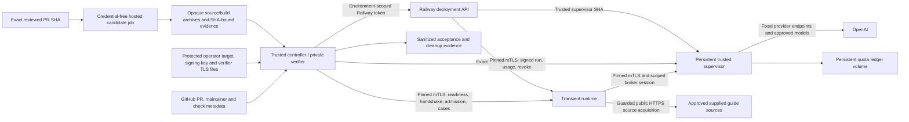

# Persistent live PR validation

> Companion operations runbook. Last reviewed: 2026-10-05.
> Implementation exists; the persistent Railway facility and paid acceptance have not been established.

This lane validates an explicitly reviewed PR revision through the real transient
Gaming workflow, a separately trusted provider supervisor, and an independent
verifier. It retains the validation environment, service definitions and quota
ledger for later authorized runs. Each run stops its candidate runtime deployment
and revokes its session. It does not deploy to production or initialize a database.

The existing project is **Arcanos**, project ID
`7faf44e5-519c-4e73-8d7a-da9f389e6187`. The proposed environment is
`live-validation`, with exactly two dedicated service instances: a runtime and a
supervisor. The project is shared with production; environment isolation does not
authorize changes to production. The target validator explicitly denies the
production environment `fb583147-6c39-4343-9267-500f357d25ab` and the protected
production web, worker, PostgreSQL and Redis resource IDs.

## Current deployment and bootstrap status

The following are actual limitations observed during bootstrap, rather than
completed provisioning steps:

| Requirement | Current evidence and blocker |
| --- | --- |
| Empty environment | The available environment-creation tool could not create the required empty environment; the attempted operation returned `UNABLE` without a mutation. **No `live-validation` environment was created.** Cloning production would inherit unsafe services and credentials and is not a substitute. |
| Provider credential | `OPENAI_API_KEY` was observed by name in production shared variables and the ARCANOS V2 and Worker variables. OAuth returned redacted values; the variable was not reported as sealed. There is no observed dedicated validation binding. This is **`SECRET_BINDING_BLOCKED_BY_TOOLING`**, not evidence that the key is missing. |
| Secure key transfer | The available variable-reference interface supports references within an environment, not a secure cross-environment reference. Reusing the approved existing key requires a secure one-time UI/CLI binding to the supervisor's `ARCANOS_LIVE_PREVIEW_OPENAI_API_KEY`, without exposing the value. Do not inherit production shared variables or copy the key through logs, chat, tracked files or workflow inputs. |
| Private verifier | No executable verifier route into the Railway private network has been established. A self-hosted runner label alone provides no DNS or routing. GitHub-hosted runners cannot resolve or reach the private service origins. |
| Egress isolation | No native domain-level Railway egress ACL is established. Implemented guards constrain the application transports; they do not constrain arbitrary code using another socket or network client. |
| Platform settings | Newly created Railway services cannot opt into the deprecated config-as-code behavior. The checked-in Railway JSON files declare the intended profiles; their presence does not apply settings to new services. Equivalent environment-scoped platform settings and readback are still required. |
| Secret scanning | Full-history scanning found **22 pre-existing findings**. The scoped changes scanned clean, but that does not clear the history gate. Findings require secure triage and, where applicable, credential remediation before paid admission. No unexplained finding is allowlisted by this lane. |
| Bound target | The example target has null resource IDs, fingerprints, supervisor SHA, authority model and prices. It intentionally fails validation and cannot authorize a run. |

Production infrastructure, production variables and production deployments remain
untouched. **Zero paid requests, validation deployments and live acceptance runs
have been performed for this facility.** Local tests and source reachability
observations do not change that status.

## Components and trust boundaries



The runtime runs the candidate's Gaming adapter and pipeline. It receives no
provider key, Railway management token, GitHub token, signing private key,
database, Redis, Notion or production credential. It starts the dedicated
validation launcher rather than the normal application or worker launcher.
Stored retrieval is skipped, ingestion is denied, actor scope is fresh for each
request and storage policy is `transient_only`.

The supervisor runs the independently reviewed `trustedSupervisorSha`. It alone
holds the provider key and the durable accounting volume. Runtime requests use
an ephemeral broker bearer, never the provider key. The verifier holds the
signing private key and the environment-scoped Railway token; it executes only
trusted controller code and treats candidate artifacts as opaque bytes. It never
extracts, imports or executes a candidate archive.

| Implemented surface | Responsibility |
| --- | --- |
| [Target policy](../scripts/live-validation-target.mjs) | Fixed project, dedicated resource IDs, production denial, exact inventory, models, limits and private peer declarations. |
| [Controller](../scripts/live-validation-controller.mjs) | Protected inputs, GitHub gates, exact deployments, observed identities, mTLS handshake, signed admission, cases, evidence and cleanup. |
| [Plan policy](../scripts/live-validation-policy.mjs) | Closed Ed25519-signed plan and identity/profile/target/expiry validation. |
| [Private transport](../scripts/live-validation-transport.mjs) | CA verification, DNS/SNI and leaf-fingerprint pins, client certificates, role authorization, bounded requests and no redirects/retries. |
| [Supervisor broker](../scripts/live-validation-broker.mjs) and [budget ledger](../scripts/live-validation-budget.mjs) | Approved provider operations, stage ordering, permanent run claims, concurrency and conservative durable reservations. |
| [Egress guards](../scripts/live-validation-egress.mjs) | Fixed provider transport and source URL checks integrated with the existing DNS/IP-pinned SSRF-safe acquisition path. |
| [Runtime launcher](../scripts/start-live-validation-runtime.mjs) / [supervisor launcher](../scripts/start-live-validation-supervisor.mjs) | Dedicated private routes and independent process credentials. |
| [Build bootstrap](../scripts/live-validation-bootstrap.mjs) and [build command](../scripts/live-validation-build.mjs) | Public Git source verification, compiled-content manifest and deployment identity. |
| [Gaming adapter](../src/liveValidationGamingAdapter.ts) | Real v2 acquisition, selection and pipeline behavior with transient external effects and stage diagnostics. |
| [Manual workflow](../.github/workflows/live-pr-acceptance.yml) | Hosted offline candidate gates followed by a protected trusted verifier job. |

## Establishing the persistent facility

Provisioning requires a supported operation path that can create an empty
environment in the existing project. Review the environment's actual inventory
before adding services. A production clone, automatically inherited shared
variables or a service operation affecting every environment fails the intended
boundary. If the operation cannot be scoped to this environment, leave bootstrap
blocked rather than applying a project-wide change.

Create unique validation-only runtime and supervisor service IDs. Before an
authorized deployment, apply and read back the settings declared by
[runtime.railway.json](../infra/live-validation/runtime.railway.json) and
[supervisor.railway.json](../infra/live-validation/supervisor.railway.json):

- Dockerfile builder with the corresponding validation Dockerfile path.
- The corresponding dedicated `start-live-validation-*.mjs` start command.
- One replica, `NEVER` restart policy, `/healthz` health check and a 30-second
  health-check timeout.
- Private networking enabled, no public/custom domains, no TCP proxy and no
  deployment triggers or automatic deployments.
- No shared variables, unrelated services, runtime volume or database/Redis
  resource. The supervisor has one quota volume mounted at
  `/var/lib/arcanos-live-validation`.

Repository source connection may affect every environment by default. Use only
a reviewed environment-scoped/staged operation with a pending-diff inspection;
do not issue an unscoped source-connect operation. Branch configuration supplies
repository wiring but does not prove the deployed commit.

The Dockerfiles clone the public repository independently, fetch and detach at
the exact `RAILWAY_GIT_COMMIT_SHA`, verify a clean source tree, use Node
`24.18.1`/npm `11.16.0`, build and write `/opt/validation/build.json`. The
manifest binds the source/tree SHA, role and compiled directory digest. Startup
recomputes compiled content and compares Railway project, environment, service,
deployment and source identities. A successful local build is not evidence that
Railway applied these settings or deployed those bytes.

Both Dockerfiles fetch only the exact SHA with depth one and no tags, keeping
historical objects out of the build cache. They use separate build and final
stages. After the clean exact-SHA
build manifest is written, `.git` is removed; Git history is absent from every
final image layer, and the checked-out application/build tree is read-only to
the running service. This prevents candidate runtime access to historical
objects. It does not resolve the historical secret findings or waive the
full-history scanner before candidate dependency/build execution.

The exact candidate commit must contain the compatible validation Dockerfile,
runtime launcher and compiled adapter. This infrastructure PR includes that
harness and can use the explicit operator bootstrap before merge. Subsequent
PRs based on the merged infrastructure inherit it. Older branches that predate
the harness need a reviewed rebase or cherry-pick; their results then apply to
the new commit SHA. Arbitrary historical commits without the harness cannot
currently use this path. A future trusted build-overlay design would require
separate review and source/build identity rules.

Bind the approved provider credential only to the supervisor through a secure
operator UI/CLI path. OAuth redaction does not provide the value needed for this
binding, and a same-environment reference cannot transfer a production key into
the new environment. Keep the existing production key and variables unchanged.
Credential rotation or a new provider key is a separate authorized operation.

Finally establish a verifier route with actual private DNS resolution and TLS
connectivity to both origins. An `arcanos-live-validation` runner label is merely
scheduling metadata. Do not add a third Railway service casually: the current
inventory contract allows exactly the runtime and supervisor. A mesh gateway,
tunnel, third service or public administrative endpoint needs an explicit trust
and inventory design before it can become an operating procedure. No public
supervisor management endpoint is implemented.

## Protected target and credentials

Start from [target.example.json](../infra/live-validation/target.example.json).
The operator must fill real validation-only environment/service IDs, private
origins, three distinct peer DNS identities and certificate fingerprints, the
reviewed supervisor commit, the actual fine-tuned authority model and approved
model prices. The example's nulls are intentional blockers.

The model set contains exactly one `ft:` authority model and the existing helper
IDs `gpt-6-luna` and `gpt-6.1-sol`. Runtime model resolution and supervisor
response-identity checks preserve the existing authority/helper roles. Do not
substitute a convenient base model to make validation pass.

Every model requires positive `inputMicroUsdPerToken` and
`outputMicroUsdPerToken` rates from the current approved pricing configuration.
Document their authority and review date with protected operator evidence. A
rate quoted as dollars per million tokens has the same numeric value in
micro-USD per token. Do not guess prices or infer them from successful requests;
missing or unsupported model/pricing configuration blocks admission.

The target fixes `writes: false`. All operator JSON, private keys, certificates
and session files live outside source checkouts, in owner-only directories
(`0700`) with owner-only files (`0600`). Symlinks and unsafe ownership/modes are
rejected. Target IDs and public fingerprints are configuration; private keys and
bearers remain secret even when they are temporary.

### Railway service variables

Configure only the role's allowlisted names in
[live-validation-target.mjs](../scripts/live-validation-target.mjs). The
inventory adapter examines names, not variable values. In particular, it rejects
production shared variables and unexpected credential names.

| Variable | Runtime | Supervisor | Delivery |
| --- | --- | --- | --- |
| `ARCANOS_LIVE_VALIDATION_TARGET_JSON` | Required | Required | Same validated target, supplied as protected configuration. |
| `ARCANOS_LIVE_VALIDATION_TLS_CA_PEM` | Required | Required | Approved private CA certificate. |
| `ARCANOS_LIVE_VALIDATION_TLS_CERT_PEM` | Runtime identity | Supervisor identity | Distinct role certificates with the configured DNS identity. |
| `ARCANOS_LIVE_VALIDATION_TLS_KEY_PEM` | Runtime private key | Supervisor private key | Secure role-specific secret binding. |
| `ARCANOS_LIVE_VALIDATION_CONTROLLER_PUBLIC_KEY_PEM` | Absent | Required | Ed25519 public verification key corresponding to the trusted operator signer. |
| `ARCANOS_LIVE_PREVIEW_OPENAI_API_KEY` | Absent | Required | Secure one-time supervisor-only provider binding; never a shared variable. |
| `RAILWAY_VOLUME_MOUNT_PATH` | Absent | Required | Platform binding to `/var/lib/arcanos-live-validation`. |
| `RAILWAY_VOLUME_NAME` | Absent | Allowed | Platform volume metadata. |
| `NODE_ENV`, `TZ`, `PORT` | Allowed | Allowed | Image defaults are production/UTC; health listener defaults to 8080, distinct from private TLS port 8443. |

Railway injects the allowed project/environment/service/deployment/source/private
domain/replica metadata. These identities are compared with the target and
manifest; they are not operator substitutes for observed platform deployments.
The runtime launcher sets worker, mock-provider and discovery behavior internally
and skips stored retrieval. Do not add normal application credential variables
or production startup flags to its service profile.

TLS material is written to protected files outside `/app` and removed from the
launcher environment after materialization. CA trust, DNS/SNI and the exact
leaf SHA256 fingerprint must all verify. Runtime, supervisor and verifier use
distinct certificates and pins. Private administrative routes require the
verifier role; runtime provider/session routes require the runtime role plus
run, deployment and bearer checks. This runbook contains no certificate or
private-key values.

### GitHub verifier environment

Create the protected GitHub environment `live-pr-acceptance` with appropriate
maintainer reviewers and branch restrictions. A name in YAML alone does not
establish those protections or connectivity.

| Protected setting | Purpose |
| --- | --- |
| Variable `LIVE_VALIDATION_TARGET_JSON` | Validated target JSON. |
| Secret `RAILWAY_LIVE_VALIDATION_TOKEN` | Token scoped to this project **and validation environment**, never production or a broad lifecycle token. |
| Secret `LIVE_VALIDATION_APPROVAL_SIGNING_KEY_PEM` | Ed25519 signing private key, never delivered to Railway runtime/supervisor. |
| Secret `LIVE_VALIDATION_MTLS_CERT_PEM` | Verifier client certificate. |
| Secret `LIVE_VALIDATION_MTLS_KEY_PEM` | Verifier client private key. |
| Secret `LIVE_VALIDATION_MTLS_CA_PEM` | Private CA certificate used for verifier TLS verification. |

The trusted step materializes these files outside its checkout. The controller
uses `LIVE_VALIDATION_APPROVAL_SIGNING_KEY_FILE`,
`LIVE_VALIDATION_MTLS_CERT_FILE`, `LIVE_VALIDATION_MTLS_KEY_FILE` and
`LIVE_VALIDATION_MTLS_CA_FILE`. The CLI also needs
`LIVE_VALIDATION_ARTIFACT_DIRECTORY` pointing to its opaque archives. Deliver
GitHub and Railway credentials through protected environment/credential-store
mechanisms; never put literal tokens in a command or document. The workflow has
no provider-key secret.

## Admission and exact-source proof

Default controller execution is offline. It validates protected files, the clean
trusted checkout, archive hashes, trusted profile hash and matching limits. It
does not contact GitHub, Railway or a provider and does not create deployments.
This mode does not establish private reachability or live readiness.

Live execution requires both `--execute` and `--allow-paid-provider`. There is
no automatic fallback or paid retry. The controller then:

1. Checks that the PR is open, ready, in `pbjustin/Arcanos`, based on `main` and
   still has the exact reviewed head SHA. Authenticates the workflow maintainer
   or operator and requires admin/maintain permission. Requires successful
   exact-head `All Checks Complete` and `docs:check` checks.
2. Validates the appropriate offline evidence authority described below.
3. Verifies Railway token project/environment scope and the complete inventory:
   exactly two allowed services, no shared variables/public routes/triggers,
   private networking and the supervisor quota volume. Truncated connection
   pages fail closed. Metadata uses `config(decryptVariables:false)` and
   variable names; responses and variable values are not logged.
4. Refuses an already active candidate runtime. Reuses a correctly pinned
   trusted supervisor, or bootstraps that service only at its separately reviewed
   supervisor SHA. Deploys the runtime with
   `serviceInstanceDeployV2(environmentId,serviceId,commitSha)`.
5. Polls the actual returned deployment IDs for `SUCCESS`, exact project,
   environment and service IDs, repository and `meta.commitHash`. Requires the
   expected deployments to be the sole active ones. Branch names, messages and
   planned SHAs are not observed proof. Fresh services may have null observed
   SHAs only during explicit predeploy inventory inspection, with no deployment.
6. Fetches private `/ready` identities and compiled-manifest hashes. Executes a
   challenge through runtime `/handshake`, which actually calls the supervisor
   over the runtime's pinned mTLS client. Both returned identities must match.
7. Rechecks the PR/check gate immediately before admission, including unchanged
   base SHA. Signs the closed `arcanos-live-validation-run/v1` plan binding
   PR/SHA, target/profile/offline evidence hashes, both deployment IDs, both
   build-manifest hashes, authorization and expiry.
8. Posts the signed envelope to supervisor `/runs`, admits its returned session
   to runtime `/admit`, and runs the two immutable profile cases. Only the
   verifier begins/ends workflows and reads aggregate usage.

The verifier's runtime acceptance request carries its test bearer and
`x-arcanos-source-commit`, `x-arcanos-deployment-id` and
`x-arcanos-live-run-id`. The broker independently checks its runtime bearer,
source, deployment, module, run and immutable paid plan on provider operations.

## Manual workflow after default-branch bootstrap

[Live PR Acceptance](../.github/workflows/live-pr-acceptance.yml) accepts only a
manual `workflow_dispatch`: `pr_number`, `expected_sha`, profile `gaming-guide`
and boolean `paid_authorized` (default false). It runs from the default branch,
serializes the facility through one concurrency group and does not cancel a
running validation. Paid workflow reruns with `run_attempt > 1` are rejected.

The hosted job checks out the exact candidate with no live secrets, scans its
full history before dependency execution, installs pinned tooling, runs type
check/lint/build/static Railway validation, both offline script suites and
focused Gaming adapter/intake tests, then scans built output. It records hashes
of `source.tar` and `build.tar` and a SHA/run/controller-bound manifest. Actions
and the scanner archive are pinned to reviewed immutable revisions/checksums.

The protected live job uses
`[self-hosted, linux, x64, arcanos-live-validation]`, checks out only the trusted
default-branch workflow revision and downloads the candidate artifact outside
that checkout. It recomputes opaque archive/manifest hashes and checks GitHub's
artifact ID, digest, workflow/run identity and successful offline job. Candidate
archives remain unextracted. Permissions are read-only; the controller does not
post GitHub comments, update reviews or merge PRs.

After the definition exists on `main` and all bootstrap gates are actually met,
a future explicitly authorized run can be dispatched with:

```bash
gh workflow run live-pr-acceptance.yml --ref main \
  --field pr_number="$LIVE_VALIDATION_PR_NUMBER" \
  --field expected_sha="$LIVE_VALIDATION_REVIEWED_SHA" \
  --field profile=gaming-guide \
  --field paid_authorized=true
```

Selecting `paid_authorized=true` authorizes a new bounded future run; it is not a
way to silently renew an exhausted current run. A new workflow cannot be
dispatched before GitHub sees its definition on the default branch. Passing
`--ref` for a feature branch does not remove that bootstrap limitation.

## Explicit initial operator bootstrap

The initial premerge route is the reviewed CLI controller with explicit
`--operator-bootstrap`. It does not claim a GitHub Actions run exists. The clean
local controller SHA must equal the protected operator attestation's
`trustedControllerSha`. This route requires independently reviewed controller
code and actual offline gate records; it is not permission to execute unreviewed
PR code with credentials.

The exact protected manifest schema is:

```json
{
  "version": "arcanos-live-validation-operator-bootstrap/v1",
  "repository": "pbjustin/Arcanos",
  "sourceCommit": "<reviewed-candidate-40-hex-SHA>",
  "prNumber": 1527,
  "profile": "gaming-guide",
  "trustedControllerSha": "<reviewed-clean-controller-40-hex-SHA>",
  "files": {
    "source.tar": "<source-archive-64-hex-SHA256>",
    "build.tar": "<build-archive-64-hex-SHA256>"
  },
  "offlineGateRecords": [
    { "gate": "type-check", "status": "PASS", "commitSha": "<candidate-SHA>", "evidenceSha256": "<evidence-SHA256>" },
    { "gate": "lint", "status": "PASS", "commitSha": "<candidate-SHA>", "evidenceSha256": "<evidence-SHA256>" },
    { "gate": "build", "status": "PASS", "commitSha": "<candidate-SHA>", "evidenceSha256": "<evidence-SHA256>" },
    { "gate": "railway", "status": "PASS", "commitSha": "<candidate-SHA>", "evidenceSha256": "<evidence-SHA256>" },
    { "gate": "workflow", "status": "PASS", "commitSha": "<candidate-SHA>", "evidenceSha256": "<evidence-SHA256>" },
    { "gate": "secret-scan", "status": "PASS", "commitSha": "<candidate-SHA>", "evidenceSha256": "<evidence-SHA256>" },
    { "gate": "private-auth", "status": "PASS", "commitSha": "<candidate-SHA>", "evidenceSha256": "<evidence-SHA256>" },
    { "gate": "egress", "status": "PASS", "commitSha": "<candidate-SHA>", "evidenceSha256": "<evidence-SHA256>" },
    { "gate": "exact-sha", "status": "PASS", "commitSha": "<candidate-SHA>", "evidenceSha256": "<evidence-SHA256>" },
    { "gate": "gaming", "status": "PASS", "commitSha": "<candidate-SHA>", "evidenceSha256": "<evidence-SHA256>" }
  ]
}
```

This is a schematic example: replace every placeholder and the PR number with
the actual reviewed values. All ten gate IDs must occur exactly once, with
successful results tied to the same candidate commit and nonzero evidence
digests. A log digest is a binding to protected operator evidence, not automatic
proof that a claimed command was run. Preserve actual redacted check results for
review. The secret-scan gate covers the full history and built output; clean
scoped changes cannot be recorded as a full-history PASS while the 22 findings
remain unresolved.

Place `source.tar` and `build.tar` in the directory designated by
`LIVE_VALIDATION_ARTIFACT_DIRECTORY`. The controller recomputes their hashes;
the protected manifest's raw SHA256 becomes the artifact attestation hash. The
offline preflight is:

```bash
node scripts/live-validation-controller.mjs --operator-bootstrap \
  --target-file /operator/live-validation/target.json \
  --artifact-attestation-file /operator/live-validation/bootstrap-attestation.json \
  --pr-number "$LIVE_VALIDATION_PR_NUMBER" --commit-sha "$LIVE_VALIDATION_REVIEWED_SHA" \
  --profile gaming-guide \
  --max-spend-micro-usd 2000000 --max-provider-requests 32 \
  --max-workflows 2 --duration-ms 600000 \
  --evidence-dir /operator/live-validation/evidence
```

Only after all real bootstrap requirements pass, the same invocation gains
`--execute --allow-paid-provider`. Execute authenticates the actual GitHub API
caller via `/user`, requires maintainer permission and current PR/check gates,
and performs the same deployment, private-channel and signed-plan checks as the
normal workflow. The operator route is forbidden inside GitHub Actions. Its
evidence authority is `operator_bootstrap`; the normal route reports
`github_actions`. A failed normal provenance gate never falls back to operator
authority.

The run ID derives from the target and immutable artifact-attestation authority.
Changing the local evidence directory cannot mint a new budget for the same
approval. Reusing a manifest/run claim is not an authorized paid retry.

## Acceptance profiles and diagnostics

The trusted [profiles.json](../examples/live-validation/profiles.json) contains
one positive and one negative case. The signed profile hash covers the entire
file and immutable inputs. Runtime, supervisor and verifier must agree on it.

| Case | Request and required result |
| --- | --- |
| `gaming-guide-positive` | An early Elden Ring Samurai/Uchigatana supplied-guide request. The real v2 workflow must acquire usable supplied evidence, select grounded evidence, generate a complete useful guide and complete a mandatory accepting answer audit bound to that final answer. The top response must be `answer_ready`, v2 outcome `accepted`, and semantic gap `NONCRITICAL_GAP`, with visible qualification that current patch compatibility is unverified. Missing patch information does not authorize invented patch facts or automatic clarification when the gap is noncritical. |
| `gaming-guide-negative` | The same Elden Ring request supplies a Sekiro combat source. It must reject incompatible evidence, return `need_new_source` with `CONFLICT`, and make zero generation/audit/provider calls for that case. Fetch success alone does not make a source compatible. |

The verifier independently runs the existing grounded/audited evidence checks,
compares exact deployed identities and supplied-document URL digests, checks v2
coverage/semantic/qualification/audit observations and reads actual supervisor
usage deltas. Runtime `profilePassed`, HTTP success or runtime-local counters
alone cannot grant acceptance.

The adapter supports other inputs accepted by the v2 Gaming contract; Elden Ring
details live in data, not a special runtime success path. Reusing the facility
for another reviewed profile requires updating and reviewing the immutable
profile and trusted hashes. The current manual choice and broker case IDs remain
the positive/negative `gaming-guide` suite; there is no arbitrary-prompt CLI.

[Controlled fixture profiles](../examples/live-validation/fixture-profiles.json)
support repeatable offline or separately approved source-hosted scenarios.
Their example origin is not a deployed fixture host and is not automatically
substituted into the live suite. Public publisher availability and source
coverage must still be observed at execution. Current profile
`sourceReachability: "unverified"` does not promise live acquisition success.
The current real URLs were selected after anonymous HTTP 200 checks. Those
checks do not prove the runtime's actual protected acquisition, parsing,
applicability, selection or acceptance.

### Clarification behavior

Clarification follows the existing user's decision and evidence requirements;
it is not a generic prerequisite for generating a guide:

| Diagnostic gap | Intended existing behavior |
| --- | --- |
| `USER_DECISION_GAP` | Return `clarification_required` when a required user choice cannot safely be inferred. |
| `EVIDENCE_GAP` | Return `need_new_source` when evidence cannot support the requested answer. |
| `NONCRITICAL_GAP` | Deliver a qualified answer when usable evidence and mandatory audit support it; the positive profile visibly qualifies unknown patch compatibility. |
| `CONFLICT` or unsafe evidence | Reject incompatible/unsafe evidence and withhold unsupported generation. The wrong-game negative case rejects its candidate and returns `need_new_source`. |

The observer derives these diagnostic categories from existing response states,
qualification and reason codes. It is not a complete stable public semantic-gap
API, and the two current profiles do not cover every clarification policy. A
follow-up should establish a typed public reason-code contract and reviewed
profiles for each decision branch. Do not broadly change CLEAR, intake or source
policy merely to make an acceptance case pass.

Diagnostic observations preserve measured acquisition, selection, generation,
intake, reasoning, final, answer-audit and response stages. They record passed,
failed, timed-out or unobserved stages, coverage/selection counts, semantic gaps,
visible freshness qualification and audit binding. Audit-start metadata includes
actual remaining runtime and request budgets. Timing hooks are observations;
missing timing is not inferred from total request latency.

When a profile or mandatory answer audit fails, the controller preserves
sanitized `observedCases`, known exact deployed identities and best-effort
supervisor usage. A timeout remains a failed audit, even after successful
generation; an available final-looking answer cannot bypass its mandatory audit.
`FAILED` distinguishes an observed acceptance failure from a bootstrap/admission
`BLOCKED` result. Cleanup and usage-readback failures remain separately visible
and do not erase the original failure code.

## Durable request, workflow, time and spend limits

| Limit | Implemented maximum |
| --- | --- |
| Reserved provider spend | `2_000_000` micro-USD, equivalent to USD 2.00. |
| Requests | 32, including model-metadata requests. |
| Workflows | Two immutable positive/negative cases. |
| Duration | 600,000 ms total controller run window; deployment/proof time reduces the remaining paid window. |
| Concurrency / retries | One provider operation at a time; zero retries. |
| Per-request token reservations | 128,000 input and 4,096 output tokens. |
| Aggregate token reservations | 400,000 tokens. |

Target limits may tighten the hard caps. Controller arguments must match the
bound target; changing a CLI flag does not silently loosen a signed policy.
The current manual workflow fixes its arguments at the hard caps; a tighter
target requires matching reviewed workflow or operator CLI arguments.
Unknown model prices, missing/unsafe ledgers, replayed run claims, interrupted
pending reservations, clock problems or exhaustion close admission.

Acceptance transport has a longer, explicitly scoped deadline so a completed
generation and its mandatory audit can return sanitized stage evidence. The
runtime captures one absolute deadline before the initial supervisor usage
read; that read consumes the adapter's work budget. Near signed-run expiry,
the runtime reserves response grace before beginning work.

| Deadline | Bound |
| --- | --- |
| Runtime initial usage plus adapter work | At most 300,000 ms, ending no later than signed expiry minus 10,000 ms. |
| Runtime usage reads | At most 5,000 ms each, further capped by their remaining absolute deadline. |
| Final usage and response construction | 10,000 ms reserved grace after the work deadline; final usage's deadline is capped by signed expiry. |
| Verifier runtime `/acceptance` request | At most 315,000 ms, capped by the controller's remaining run window. |
| Other verifier control requests | At most 60,000 ms, capped by the remaining run window during normal execution. |
| Private client/server defaults | 120,000 ms; the runtime server explicitly permits 600,000 ms idle time. |
| Private transport configurable maximum | 600,000 ms; a caller cannot exceed its configured client ceiling. |
| Provider call | At most 120,000 ms, further capped by remaining signed-run time. |

These bounds do not extend the 600,000 ms aggregate run, provider quotas or
source-fetch deadlines. Supervisor provider transport retains its default
120,000 ms ceiling. Cleanup and best-effort diagnostics may run after paid
admission expires; they cannot authorize more provider work. Reserved response
grace does not guarantee synchronized delivery before expiry. Signed broker
expiry and controller workflow/usage gates reject a late completion; a stalled
or disconnected remote application may still return no evidence.

The supervisor uses owner-only ledger files, locks, exclusive run claims, atomic
writes and fsync on its persistent volume. Requests reserve conservative token
and price amounts before provider access. Observed usage is settled from the
provider response; failed/timed-out reservations are not refunded. Restarts do
not clear the run claim or reset counters, and stale locks are not automatically
recovered. Do not delete the volume or ledger to obtain another attempt.

The broker allows only approved textual Responses API calls and model metadata
lookups at fixed OpenAI endpoints. It disables storage/streaming/tools, endpoint
overrides, redirects and retries. Source acquisition uses the existing SSRF-safe
transport plus the validation source guard, including blocked production,
provider and private/internal destinations. These are application controls,
not a platform firewall against arbitrary reviewed candidate code.

The provider cap is an application reservation limit based on approved prices.
Exact upstream billing is not independently verified, and cancellation does not
promise a provider refund. Railway builds, deployments, retained supervisor and
volume costs are outside this provider-spend cap. Reusing an existing provider
key also shares its upstream account/project quota and billing context.

## Cleanup, retention and incident handling

The controller always attempts supervisor `/runs/{runId}/stop` and verifies that
usage reports the run stopped. It then stops only the exact runtime deployment
ID durably recorded from its own deploy mutation. Before stopping, it verifies
token scope and actual project/environment/runtime-service ownership. A wrongly
deployed source SHA is still stopped when that created ID's ownership matches;
an ambiguous, foreign, latest-but-unrecorded deployment or supervisor is not.

Cleanup reads the stopped deployment back and rechecks retained definitions and
the quota volume. It does not delete an environment, service, volume, provider
binding or ledger, and does not stop the persistent supervisor. Repeating cleanup
does fresh platform readback rather than relying on an earlier local PASS:

```bash
node scripts/live-validation-controller.mjs cleanup \
  --target-file /operator/live-validation/target.json \
  --pr-number "$LIVE_VALIDATION_PR_NUMBER" --commit-sha "$LIVE_VALIDATION_REVIEWED_SHA" \
  --profile gaming-guide \
  --evidence-dir /operator/live-validation/evidence
```

Keep the protected state/evidence directory until cleanup succeeds. If ownership
or scope cannot be proven, retain the blocker and investigate using metadata
only. Do not broaden cleanup to production or delete shared resources. Broker
expiry/cancellation independently stops provider admission; a missing runner or
network route can still prevent platform cleanup, so expiry is not proof that a
Railway deployment was stopped.

Only `acceptance-summary.json` and `cleanup-summary.json` are uploaded as public
workflow evidence, retained for 14 days. Candidate evidence has a seven-day
retention. `controller-state.private.json` stores cleanup ownership and temporary
session state outside the checkout; it is never uploaded. Successful cleanup
clears the stored session. Workflow temporary signer/TLS/operator files are
removed through a narrowly scoped final step. A failed cleanup may require
protected state retention for recovery.

Evidence contains IDs, hashes, bounded counters, selected audit/status fields and
timings. It contains no full guide answer, prompts, source passages, raw provider
responses, tokens, keys or raw errors. Current session-bearer material hidden in
an otherwise valid diagnostic field causes evidence rejection. The reported
`durableWrites: 0` refers to request ingestion/memory/database effects; the
supervisor's security quota ledger deliberately performs durable writes.

## Validation and honest operating limits

Use the repository's pinned Node/npm toolchain. These local commands validate
implementation and contracts without provisioning this facility:

```bash
npm run type-check
npm run lint
npm run build
npm run validate:railway
npm run test:live-pr-preview:offline
npm run test:live-validation:offline
node scripts/run-jest.mjs --runTestsByPath \
  tests/live-validation-gaming-adapter.test.ts tests/live-validation-source-guard.test.ts \
  tests/trinity-gaming-intake.test.ts --coverage=false
npm run docs:check
npm run docs:links
```

Script tests cover protected targets, exact SHA, GitHub provenance/moved heads,
private TLS/authentication, provider egress, ledger concurrency/replay/expiry,
profile rejection, sanitized failure evidence and scoped cleanup. Mocked tests
do not establish private-network access, secure credential delivery, actual
Railway deployment identity, provider acceptance or cleanup on the real platform.

The latest local implementation validation completed with 862 passed and 13
skipped Jest suites, containing 16,393 passed and 167 skipped tests. The legacy
offline script suite passed 118 tests and the persistent validation script suite
passed 161 tests, including the bounded acceptance-deadline and shallow-build checks. Type
checking, build and static Railway validation passed;
lint reported zero errors and 76 existing warnings. These are local checkout
results with the implementation changes included, not deployed or paid proof.

This facility proves the supported transient backend acceptance path when it is
actually executed successfully. It does not prove normal authenticated public
application routes, ChatGPT/plugin OAuth consent, production readiness, durable
ingestion/retrieval, active workers or PostgreSQL behavior. Sanitized backend
acceptance is not an independent human editorial review of a generated guide.
Changing profiles, credentials, pricing, TLS trust, network exposure or platform
topology requires renewed review and corresponding executable checks.

For related boundaries, see [isolated live PR preview](LIVE_PR_PREVIEW.md),
[Railway deployment and command safety](RAILWAY_DEPLOYMENT.md),
[configuration](CONFIGURATION.md), [CI](CI_CD.md) and
[documentation maintenance](DOCUMENTATION.md).
